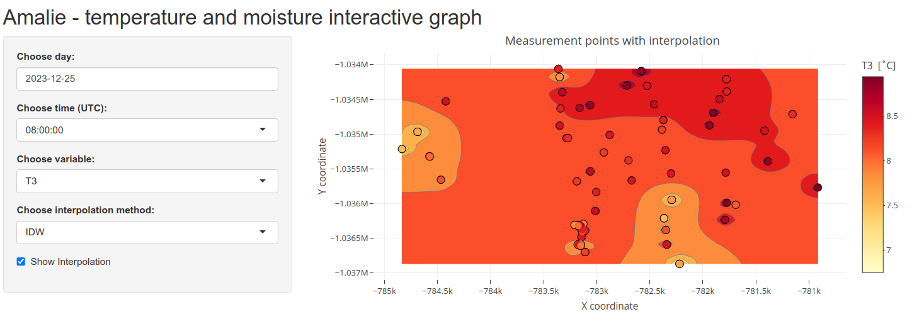

# Soil temperatures and soil moisture on Amalie site, Czech Republic

Interactive shiny R graph for displaying soil temperature and soil moisture data from measuring site Amalie which is operated by Czech University of Life Sciences Prague, Faculty of Environmental Sciences, Department of Water Resources and Environmental Modeling. 

---

The user has an option of rendering interpolation map, which is still under development. The analysed interpolation methods are:

- ✅ **IDW**
- 🛠️ **Kriging**
- 🛠️ **Akima Linear**
- 🛠️ **...**

---

The input data are available upon request at `jakubcovam@fzp.czu.cz`.

---
